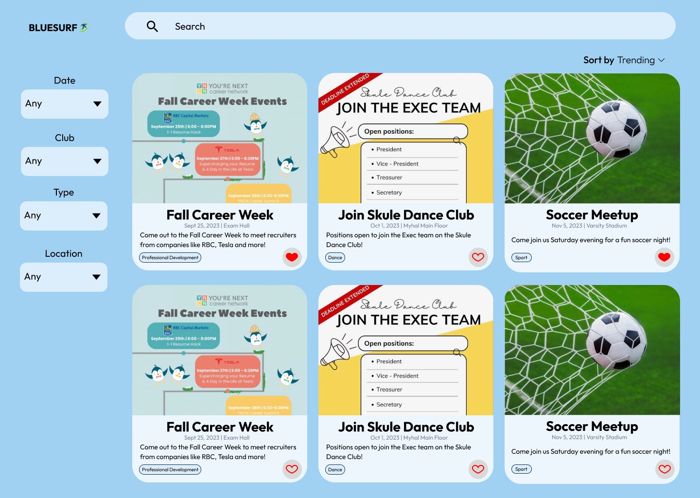

<a name="readme-top"></a>

<!-- PROJECT SHIELDS -->
<!-- 
[![Contributors][contributors-shield]][contributors-url]
[![Forks][forks-shield]][forks-url]
[![Stargazers][stars-shield]][stars-url]
[![Issues][issues-shield]][issues-url]
[![MIT License][license-shield]][license-url] -->

<!-- PROJECT LOGO -->
<br />
<div align="center">
  <a href="https://github.com/ECE444-2023Fall/Blue-Surf">
    
  </a>

<h3 align="center">BlueSurf</h3>

  <p align="center">
    Your one-stop destination for seamless event discovery, connecting UofT students, clubs, and design teams to create vibrant campus experiences.
    <br />
    <a href="https://github.com/ECE444-2023Fall/Blue-Surf">View Demo</a>
    ·
    <a href="https://github.com/ECE444-2023Fall/Blue-Surf/issues">Report Bug</a>
    ·
    <a href="https://github.com/ECE444-2023Fall/Blue-Surf/issues">Request Feature</a>
    .
    <a href="https://github.com/orgs/ECE444-2023Fall/projects/17">Project Management</a>
  </p>
</div>

<!-- TABLE OF CONTENTS -->
<details>
  <summary>Table of Contents</summary>
  <ol>
    <li>
      <a href="#about-the-project">About The Project</a>
      <ul>
        <li><a href="#built-with">Built With</a></li>
      </ul>
    </li>
    <li>
      <a href="#getting-started">Getting Started</a>
      <ul>
        <li><a href="#prerequisites">Prerequisites</a></li>
        <!-- <li><a href="#installation">Installation</a></li> -->
      </ul>
    </li>
    <li><a href="#roadmap">Roadmap</a></li>
    <!-- <li><a href="#contributing">Contributing</a></li> -->
    <li><a href="#license">License</a></li>
    <li><a href="#contact">Contact</a></li>
    <li><a href="#acknowledgments">Acknowledgments</a></li>
  </ol>
</details>

<!-- ABOUT THE PROJECT -->

## About The Project



### Ride the Wave with Blue Surf!

Welcome to Blue Surf, your ultimate campus companion for all things University of Toronto (UofT). Our mission? To transform your campus life into a thrilling journey of discovery, connection, and endless opportunities!

🏄‍♂️ <b>Seamless Event Discovery:</b> With Blue Surf, effortlessly catch the wave of exciting campus events. Say goodbye to lost flyers and missed opportunities!

🌊 <b>One-Stop Campus Hub:</b> Our user-friendly platform lets you post, explore, and engage with events - no need to surf the web, bulletin boards, or social media!

📣 <b>Amplify Your Voice:</b> Whether you're a club leader, an individual with a message, or a student seeking the next big thing, Blue Surf is your megaphone. Share announcements, recruit for your club, or discover the coolest events with ease.

🤙 <b>Join the Blue Surf Community:</b> Let's ride this wave together and create a vibrant, connected campus life. Blue Surf is all about making your university experience unforgettable!

So, grab your virtual surfboard and get ready for an exciting ride with Blue Surf. We're here to make waves and can't wait for you to dive in!
<p align="right">(<a href="#readme-top">back to top</a>)</p>

### Built With

- [![Flask][Flask.com]][Flask-url]
- [![React][React.js]][React-url]
- [![Bootstrap][Bootstrap.com]][Bootstrap-url]
- [![Postgres][Postgres.com]][Postgres-url]

<p align="right">(<a href="#readme-top">back to top</a>)</p>

<!-- GETTING STARTED -->

## Getting Started

[](https://classroom.github.com/online_ide?assignment_repo_id=11923874&assignment_repo_type=AssignmentRepo)

These instructions will help you get your project up and running on your local machine!

### Prerequisites
After creating and activating a virtual environment, run the following command to install all the dependencies: 

- pip
  ```sh
  pip install -r requirements.txt
  ```

Create a file named `.env` in the root directory and add the following content there: 

- env
  ```sh
  export SECRET_KEY=fdkjshfhjsdfdskfdsfdcbsjdkfdsdf 
  export DEBUG=True 
  export APP_SETTINGS=config.DevelopmentConfig 
  export DATABASE_URL=sqlite:///db.sqlite 
  export FLASK_APP=src 
  export FLASK_DEBUG=1 
  export SECURITY_PASSWORD_SALT=fkslkfsdlkfnsdfnsfd 
  export EMAIL_USER=your-email 
  export EMAIL_PASSWORD=your-password 
  ```

Run the following command to export all the environment variables from the `.env` file: 
- source
  ```sh
  source .env 
  ```

Run the following commands to set up the database: 
- flask
  ```sh
  flask db init 
  flask db upgrade
  ```
Run the following command to run the Flask server: 
- python
  ```sh
  python manage.py run 
  ```

<!-- ### Installation

1. Get a free API Key at [https://example.com](https://example.com)
2. Clone the repo
   ```sh
   git clone https://github.com/github_username/repo_name.git
   ```
3. Install NPM packages
   ```sh
   npm install
   ```
4. Enter your API in `config.js`
   ```js
   const API_KEY = "ENTER YOUR API";
   ``` -->

<p align="right">(<a href="#readme-top">back to top</a>)</p>

<!-- ROADMAP -->

## Roadmap
List of features currently under development by categories 🛠 

- [ ] Searching for Posts
    - [ ] Search by keywords
- [ ] Filtering and Sorting
    - [ ] Filter posts with the use of tags
    - [ ] Filter posts by date and time
- [ ] Creating Posts
    - [ ] Input information to curate a post
- [ ] Managing Posts
    - [ ] Automatically take down a post after a given expiry date
    - [ ] Individual to be able to edit their post after it has been posted
    - [ ] Delete a post
- [ ] Interacting with Posts
    - [ ] View how many users are interested in an event (I.e., to provide an estimate if how many people will join the event). 
- [ ] Personal Dashboards: 
    - [ ] View events without having to sign in/create login in page. 

See the [open issues](https://github.com/ECE444-2023Fall/Blue-Surf/issues) for a full list of proposed features (and known issues).

<p align="right">(<a href="#readme-top">back to top</a>)</p>

<!-- CONTRIBUTING -->

<!-- ## Contributing

Contributions are what make the open source community such an amazing place to learn, inspire, and create. Any contributions you make are **greatly appreciated**.

If you have a suggestion that would make this better, please fork the repo and create a pull request. You can also simply open an issue with the tag "enhancement".
Don't forget to give the project a star! Thanks again!

1. Fork the Project
2. Create your Feature Branch (`git checkout -b feature/AmazingFeature`)
3. Commit your Changes (`git commit -m 'Add some AmazingFeature'`)
4. Push to the Branch (`git push origin feature/AmazingFeature`)
5. Open a Pull Request

<p align="right">(<a href="#readme-top">back to top</a>)</p> -->

<!-- LICENSE -->

## License

Distributed under the MIT License. See `LICENSE.txt` for more information.

<p align="right">(<a href="#readme-top">back to top</a>)</p>

<!-- CONTACT -->

## Contact Us

Project Link: [https://github.com/ECE444-2023Fall/Blue-Surf](https://github.com/ECE444-2023Fall/Blue-Surf)

The Team
- Meriam Fourati | [meriam.fourati@mail.utoronto.ca](mailto:meriam.fourati@mail.utoronto.ca)
- Divya Kaur | [divya.kaur@mail.utoronto.ca](mailto:divya.kaur@mail.utoronto.ca)
- Ji Oh Kim | [ jioh.kim@mail.utoronto.ca](mailto:jioh.kim@mail.utoronto.ca)
- Tenzin Mahabir | [tenzin.mahabir@mail.utoronto.ca](mailto:tenzin.mahabir@mail.utoronto.ca)
- Kirti Mehra | [kirti.mehra@mail.utoronto.ca](mailto:kirti.mehra@mail.utoronto.ca)
- Paula Perdomo | [paula.perdomo@mail.utoronto.ca ](mailto:paula.perdomo@mail.utoronto.ca )
- Karishma Shah | [karishma.shah@mail.utoronto.ca](mailto:karishma.shah@mail.utoronto.ca)

<p align="right">(<a href="#readme-top">back to top</a>)</p>

<!-- ACKNOWLEDGMENTS -->

## Acknowledgments

- [ReadMe Template](https://github.com/othneildrew/Best-README-Template)
- [Code of Conduct Template](https://docs.github.com/en/communities/setting-up-your-project-for-healthy-contributions/adding-a-code-of-conduct-to-your-project)
- [Contributions Template](https://gist.github.com/briandk/3d2e8b3ec8daf5a27a62 )

<p align="right">(<a href="#readme-top">back to top</a>)</p>

<!-- MARKDOWN LINKS & IMAGES -->
<!-- https://www.markdownguide.org/basic-syntax/#reference-style-links -->

[contributors-shield]: https://img.shields.io/github/contributors/github_username/repo_name.svg?style=for-the-badge
[contributors-url]: https://github.com/ECE444-2023Fall/Blue-Surf/graphs/contributors
[forks-shield]: https://img.shields.io/github/forks/github_username/repo_name.svg?style=for-the-badge
[forks-url]: https://github.com/ECE444-2023Fall/Blue-Surf/network/members
[stars-shield]: https://img.shields.io/github/stars/github_username/repo_name.svg?style=for-the-badge
[stars-url]: https://github.com/ECE444-2023Fall/Blue-Surf/stargazers
[issues-shield]: https://img.shields.io/github/issues/github_username/repo_name.svg?style=for-the-badge
[issues-url]: https://github.com/ECE444-2023Fall/Blue-Surf/issues
[license-shield]: https://img.shields.io/github/license/github_username/repo_name.svg?style=for-the-badge
[license-url]: https://github.com/github_username/repo_name/blob/master/LICENSE.txt
[linkedin-shield]: https://img.shields.io/badge/-LinkedIn-black.svg?style=for-the-badge&logo=linkedin&colorB=555
[linkedin-url]: https://linkedin.com/in/linkedin_username
[product-screenshot]: images/screenshot.png
[Flask.com]: https://img.shields.io/badge/Flask-20232A?style=for-the-badge&logo=flask&logoColor=61DAFB
[Flask-url]: https://flask.palletsprojects.com/en/3.0.x/
[Next.js]: https://img.shields.io/badge/next.js-000000?style=for-the-badge&logo=nextdotjs&logoColor=white
[Next-url]: https://nextjs.org/
[React.js]: https://img.shields.io/badge/React-20232A?style=for-the-badge&logo=react&logoColor=61DAFB
[React-url]: https://reactjs.org/
[Vue.js]: https://img.shields.io/badge/Vue.js-35495E?style=for-the-badge&logo=vuedotjs&logoColor=4FC08D
[Vue-url]: https://vuejs.org/
[Angular.io]: https://img.shields.io/badge/Angular-DD0031?style=for-the-badge&logo=angular&logoColor=white
[Angular-url]: https://angular.io/
[Svelte.dev]: https://img.shields.io/badge/Svelte-4A4A55?style=for-the-badge&logo=svelte&logoColor=FF3E00
[Svelte-url]: https://svelte.dev/
[Laravel.com]: https://img.shields.io/badge/Laravel-FF2D20?style=for-the-badge&logo=laravel&logoColor=white
[Laravel-url]: https://laravel.com
[Bootstrap.com]: https://img.shields.io/badge/Bootstrap-563D7C?style=for-the-badge&logo=bootstrap&logoColor=white
[Bootstrap-url]: https://getbootstrap.com
[JQuery.com]: https://img.shields.io/badge/jQuery-0769AD?style=for-the-badge&logo=jquery&logoColor=white
[JQuery-url]: https://jquery.com
[Postgres-url]: https://www.postgresql.org/docs/
[Postgres.com]: https://img.shields.io/badge/postgresql-35495E?style=for-the-badge&logo=postgresql&logoColor=white
